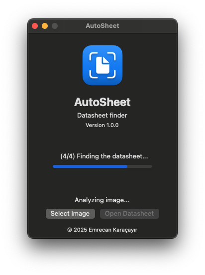
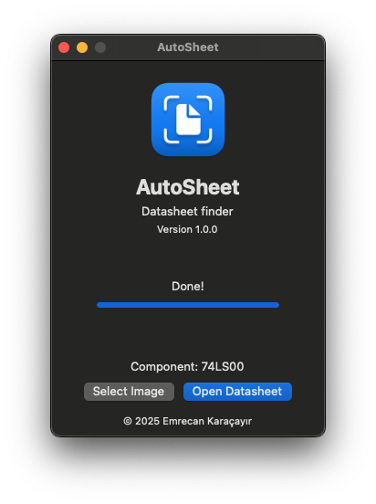

<div align="center">
    

# AutoSheet

Automatic datasheet finder

</div>

## 📖 Description

AutoSheet is a cross-platform application that automatically finds datasheets for electronic components. It uses a combination of image processing and machine learning to identify the part number on a component to provide the corresponding datasheet.

## 🚀 Features

- Automatic part number recognition
- Datasheet search
- Cross-platform support

## 📸 Screenshots

<div align="center">
    
    
</div>

## 🛠️ Technologies

- [Python](https://www.python.org/)
- [OpenCV](https://opencv.org/)
- [EasyOCR](https://github.com/JaidedAI/EasyOCR)
- [NumPy](https://numpy.org/)
- [WxPython](https://wxpython.org/)

## 📦 Installation

### 📝 Prerequisites

- Python 3.13 or higher:
  - _For macOS:_
    ```bash
    brew install python3
    ```
  - _For Windows:_
    ```powershell
    winget install -e --id Python.Python.3.XX
    ```
  - _For Linux:_ Use the package manager of your distribution
- GNU Make:
  - _For macOS:_
    ```bash
    brew install make
    ```
  - _For Windows:_
    ```powershell
    winget install -e --id GnuWin32.Make
    ```
  - _For Linux:_ Use the package manager of your distribution

### 🪜 Steps

1. Clone the repository:
   ```bash
   git clone https://github.com/EmrecanKaracayir/AutoSheet.git
   ```
2. Change the directory to the project folder:
   ```bash
   cd AutoSheet
   ```
3. Initialize the virtual environment:
   ```bash
   make init
   ```
4. Activate the virtual environment:
   - _For macOS & Linux (Fish Shell):_
     ```fish
     source venv/bin/activate.fish
     ```
   - _For macOS & Linux (Bash Shell):_
     ```bash
     source venv/bin/activate
     ```
   - _For Windows (PowerShell):_
     ```powershell
     .\venv\Scripts\Activate.ps1
     ```
   - _For Windows (Command Prompt):_
     ```cmd
     .\venv\Scripts\activate.bat
     ```
5. Install the required packages:
   - _For production:_
     ```bash
     make install
     ```
   - _For development:_
     ```bash
     make install-dev
     ```
6. Run the application:
   - _For production:_
     ```bash
     make run
     ```
   - _For development:_
     ```bash
     make run-dev
     ```

### ⚙️ Other Commands

- For cleaning:
  ```bash
  make clean
  ```
- For cleaning cache:
  ```bash
  make clean-cache
  ```
- For formatting:
  ```bash
  make format
  ```
- For linting:
  ```bash
  make lint
  ```
- For testing:
  ```bash
  make test
  ```
- For packaging:
  ```bash
  make package
  ```

## 📜 License

This project is licensed under the MIT License - see the [LICENSE](LICENSE.md) file for details.
